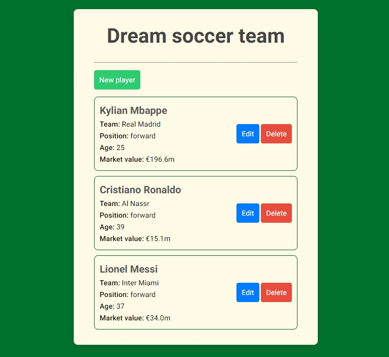
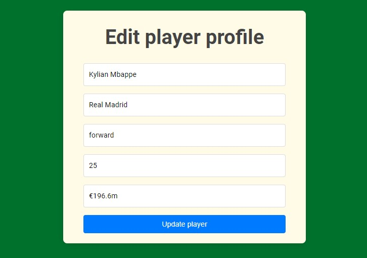
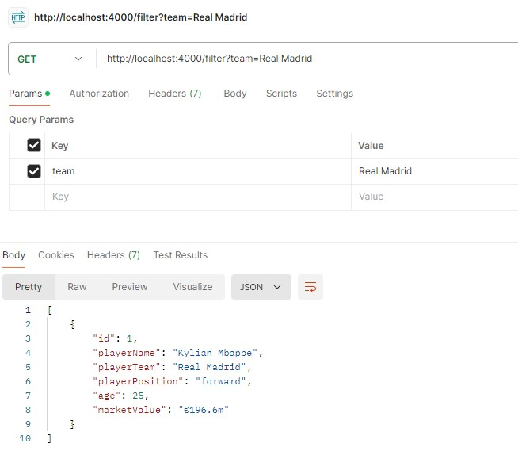

# DreamSoccerTeam-API

I present my own API with backend and simple frontend to communicate with an API.

An API allows to build a soccer team and store a basic information about players (name, team, position, market value).

An app consists of two servers (operating simultaneously):

- port 3000, app backend -> makes API requests,
- port 4000, API backend -> my API responds.

There is no connection to the real database, data are stored in an array (in memory data store).

A REST API approach:

- use CRUD operations to perform the most common tasks of data management,
- generate JSON output,
- use status code in error handling.

## Table of contents

- [Overview](#overview)
  - [How to start](#how-to-start)
  - [DreamSoccerTeam API](#dreamsoccerteam-api)
  - [Screenshot](#screenshot)
- [My process](#my-process)
  - [Built with](#built-with)
  - [Useful resources](#useful-resources)

## Overview

### How to start

Running on localhost:

- use e.g. Visual Studio Code,
- run command to install dependencies -> npm i,
- run command to install nodemon globally on the PC -> npm i -g nodemon,
- run command -> nodemon index.js,
- open separate terminal and run command -> nodemon server.js,
- website is running on localhost, so open a web browser and run http://localhost:3000/

or use Postman for API testing:

- use e.g. Visual Studio Code,
- run command to install dependencies -> npm i,
- run command to install nodemon globally on the PC -> npm i -g nodemon,
- run command -> nodemon index.js,

- sign up for a Postman Account,
- select "HTTP Request" to create a new request,
- enter request methods, parameters and url with proper endpoint.

### DreamSoccerTeam API

- GET - Random player

http://localhost:4000/random

Get a random player from the DreamSoccerTeam API.

- GET - All players

http://localhost:4000/all

Get a random player from the DreamSoccerTeam API.

- GET - Specific player

Responds with a single player with the requested player id.\
Provide the player id as a path parameter.

http://localhost:4000/players/:id

Provide the player id as a path parameter.

- GET - Filtered player by team

Filters all the players by their player team.\
Provide a query parameter for team and if the team exists, then you should get back all the players that match that team.

http://localhost:4000/filter

- POST - Create new player profile

Create a new player to add into the array of players.\
Need to provide body parameters for name, team, position, age and marketValue. Player id will be autogenerated.

http://localhost:4000/players

- PATCH - Edit player profile

Edit a player for the id that is specified in the path parameter.\
Provide optional values for either the name, team, position, age or the marketValue.

http://localhost:4000/players/:id

- DELETE - Delete player profile

Delete a player from the array of players based on the path parameter provided for the player id.\
Will return an error if no players match the provided id.

http://localhost:4000/players/:id

- DELETE - Delete all player profiles

Delete all players in the array.

Authentication:\
Requires the api key to perform this action.

http://localhost:4000/all

### Screenshot

- Main page with players list:

- Modify player profile:

- Postman, e.g. GET request with query params

## My process

### Built with

- Node.js project using Express.js,
- include Axios for making HTTP requests,
- include EJS for templating,
- user-friendly GUI - HTML and CSS,
- REST API approach.

### Useful resources

- [Web Development Bootcamp](https://www.udemy.com/course/the-complete-web-development-bootcamp)
- [Express.js documentation](https://expressjs.com/)
- [Node.js documentation](https://nodejs.org/docs/latest/api/)
- [Axios documentation](https://axios-http.com/docs/intro)
- [Postman - API testing tool](https://www.postman.com/)
